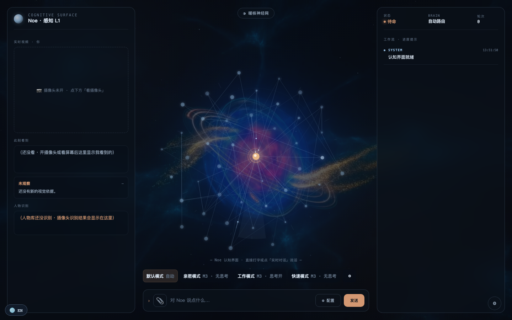
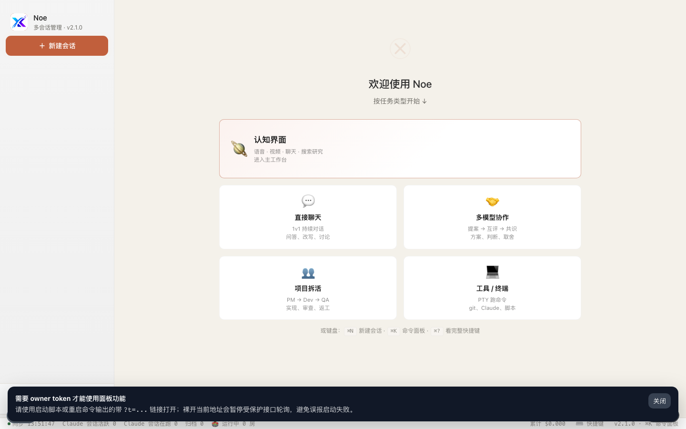
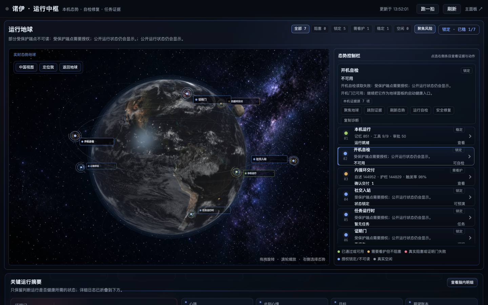

<div align="center">



# ⚡ Neo · Noe

## 당신만의 개인 AI 운영체제 — 기억하고, 성장하며, 오직 당신의 것

*The personal AI OS that remembers, evolves, and runs entirely on your machine.*

[](https://github.com/BB20260410/neo-jarvis/actions/workflows/test.yml) &nbsp;
 &nbsp;
 &nbsp;
 &nbsp;


### 모든 사람에게, 자신을 진정으로 이해하고 스스로 진화하는 AI 파트너를.

**🌐 [English](README.md) · [简体中文](README.zh-CN.md) · [日本語](README.ja.md) · 한국어 · [Español](README.es.md)**

</div>

---

## 🌌 왜 Neo인가

오늘날의 AI는 똑똑하지만 **잘 잊고, 수동적이며, 남의 서버 위에 산다**. 매일 당신은 자신을 다시 소개하고, AI는 대답하는 순간 잊어버린다. 노트북을 닫으면 다시 남남이다.

**Neo는 다른 존재가 되려 한다.**

당신을 기억하고, 당신의 화면을 보고, 당신의 말을 듣는 동반자. 하나의 모델이 홀로 싸우는 것이 아니라 **여러** AI 모델이 당신과 나란히 일하는 작업 공간. 그리고 당신이 쉬는 동안 **스스로 돌아보고, 스스로 개선하며, 자신을 더 낫게 만드는** 시스템.

그리고 그것은 **오직 당신의 것**. 당신의 기기 위에서 돌아가며 데이터도 기억도 사고도 모두 로컬에 머문다. 클라우드 제품의 클라이언트가 아니다. 이것은 **당신의** AI OS다.

---

## ✨ Neo가 할 수 있는 것

> 🔄 **스스로 진화한다** — 자신의 상태를 돌아보고, 개선 방향을 스스로 정하며, **자신의 소스 코드를 다시 쓰고**, 테스트를 돌려 더블 그린 게이트와 다중 모델 검토를 통과해야만 반영한다. AI는 멈춰 있는 도구가 아니라 성장하는 시스템이 된다.

> 🧩 **하나가 아닌 AI 팀** — 로컬 주 두뇌 + 검토 두뇌 + 클라우드 강력 모델이 작업별로 분담하고 교차 검증한다. 한 모델의 환각을 다른 모델이 그 자리에서 잡아낸다.

> 💾 **결코 잊지 않는다** — 3계층 영속 기억(시맨틱 지식 베이스 + 파일 기억 + 기억 그래프). 세션을 넘어 당신을 기억하고, 배운 교훈을 다음 대화에 스스로 가져온다. 쓸수록 당신을 이해한다.

> 🎙️👁️🤝 **듣고, 보고, 먼저 다가온다** — 로컬 음성 입출력, 화면을 읽는 비전 모델, 그리고 *절제된* 능동성 — 스팸이 아니라 적절한 순간에 말을 건다.

> 🪞 **투명한 내면** — 의식의 흐름, 목표, 기대, 감정 상태(VAD / 글로벌 워크스페이스)를 모두 시각화. 블랙박스가 아니라 *그것이 무엇을 생각하는지 볼 수 있다*.

---

## 📸 실제 화면

> 모두 로컬 `http://127.0.0.1:51835`에서 동작하는 Neo의 실제 화면.

**메인 워크스페이스** — 직접 대화 / 다중 모델 협업 / 프로젝트 분해 / 도구·터미널을 한 곳에서


**내면 뷰** — 3D 상황 지구본으로 실행 상태·자가 점검·작업·기억을 한눈에


---

## 🔬 「자가 진화」는 실제로 돌아간다

```
   자신의 데이터를 돌아본다(어디를 더 낫게?)
            │
            ▼
   자율적으로 방향 제안 ──► 가치 앵커: 기술적 착지점이 있나? 검증 가능한가? 점수 벌이가 아닌가?
            │
            ▼
   모델이 자신의 소스를 다시 씀(작고 진짜인 논리 개선 우선)
            │
            ▼
   더블 그린 게이트: 변경 전후 모두 테스트 전부 통과  ──►  실패 시 롤백
            │
            ▼
   다중 모델 검토 ──► 통과 시 반영·기록 / 실패 시 정직하게 기록
```

가치 앵커와 reward-hacking 서킷 브레이커가 「진화하는 것처럼 보이려」는 무의미한 변경을 막는다. 이것은 로드맵상의 구상이 아니라 **지금 돌아가는** 메커니즘이다.

---

## 🚀 로드맵 · 우리가 향하는 곳

> 아래는 **제품 비전과 목표**이며 진행 상황을 표시: 🟢 완료 / 🟡 진행 중 / 🔵 계획 중.

**1단계 · 살아있는 개인 AI OS** 🟢
로컬 퍼스트 아키텍처, 멀티 AI 클러스터, 3계층 기억, 음성/시각/능동적 동행, 자가 진화 루프 — **완료·가동 중**.

**2단계 · 점점 더 잘 진화하기** 🟡
자가 진화의 착지율과 탐색 폭을 높이고, 기억 그래프를 진짜로 추론에 참여시키며, 자율 호출 가능한 도구를 확장. Neo를 매일 어제보다 조금 더 강하게.

**3단계 · 매끄러운 멀티모달 부조종사** 🔵
음성·시각·텍스트·도구의 일체화; 더 똑똑한 능동성(필요할 때와 조용해야 할 때를 이해); 여러 기기에서 같은 「그것」을 이어감.

**궁극의 비전 · 모두를 위한 자비스** 🔵
완전히 당신의 것이고, 당신의 기기에서 돌아가며, 쓸수록 당신을 이해하고, 당신을 대신해 생각하고 행동할 수 있는 AI 운영체제. 빌린 지능이 아니라 당신 자신의 것.

---

## 🛠️ 기술 스택

| 레이어 | 선택 |
|---|---|
| 백엔드 | Node.js 22.x + Express + WebSocket, 전부 ES Module |
| 프런트엔드 | 순수 Web GUI(무거운 프레임워크 없음), macOS `.app`로 패키징 가능 |
| 데이터 | SQLite 데이터 기반 + 로컬 벡터 검색 |
| 모델 | LM Studio / Ollama 경유 로컬(qwen, gemma 등); 클라우드는 선택 |
| 품질 | 전체 유닛 테스트 + E2E 워크스루 + 성능/헬스 감사 게이트 |

---

## 🚀 빠른 시작

**Node.js 22.x 필요** — `npm start`는 버전 가드(`scripts/ensure-node22.mjs`)를 거치며 "22 이상"이 아니라 Node 22 메이저 버전을 엄격히 요구합니다. 기본 `node`가 다른 메이저 버전이라면 Node 22를 설치하거나(예: `nvm install 22`) `NOE_NODE_BIN`으로 Node 22 바이너리를 지정하세요.

```bash
# 1) 의존성 설치
npm install --omit=dev   # 런타임 전용 — node_modules 약 210 MB, 패널 실행에 충분
# npm install            # 전체 설치(개발 / 테스트 실행용) — 약 850 MB+ (Electron, Playwright, Vitest 등 포함)

# 2) 시작(기본 127.0.0.1:51835, 로컬 전용)
npm start

# 3) 시작 로그에 출력된 URL을 연다 — owner 토큰이 붙어 있다:
#    🚀 Noe @ http://127.0.0.1:51835/?t=<owner-token>
```

> **중요:** 로그에 출력된 **`?t=...`가 붙은 전체 URL**을 열어야 합니다. `http://127.0.0.1:51835`를 그냥 열면 페이지 골격은 보이지만 모든 API가 401을 반환합니다 — `?t=`의 토큰이 owner 인증 그 자체입니다(프런트엔드가 `sessionStorage`에 저장). macOS에서는 대화형 터미널에서 `npm start` 하면 올바른 URL이 브라우저로 자동으로 열립니다. `.env`는 선택 사항 — 주요 스위치는 [`.env.example`](.env.example) 참고.

---

## 🧭 첫 실행에서 보게 되는 것

- **UI는 현재 중국어가 중심입니다.** 영어 UI는 로드맵에 있으며, 당분간 코드·로그·README가 영어 진입점입니다.
- **로컬 모델도 클라우드 키도 없으면,** 패널은 정상 기동하고 모든 페이지를 볼 수 있지만 채팅 응답은 실패합니다 — 최소 하나의 "두뇌"가 필요합니다. 가장 빠른 첫걸음: [LM Studio](https://lmstudio.ai)(기본 `http://127.0.0.1:1234/v1`)나 [Ollama](https://ollama.com)(기본 `http://127.0.0.1:11434`)로 로컬 모델을 띄우고 `cp .env.example .env` 후 `NOE_LMSTUDIO_URL` / `NOE_OLLAMA_URL`을 가리키세요.
- **음성·시각은 동반 로컬 서비스가 필요**(Whisper STT, OpenAI 호환 엔드포인트의 VLM). **자가 진화는 기본 OFF**(`NOE_SELF_EVOLUTION=1`로 활성화, `NOE_SELF_EVOLUTION_REAL_APPLY=1`을 켜지 않는 한 dry-run).

---

## 🎯 정직한 안내

Neo는 **개인 / 실험적 프로젝트**이며 프라이버시 퍼스트·로컬 퍼스트. **완료된** 기능(자가 진화 루프, 멀티 AI 협업, 3계층 기억, 음성/시각)은 실제로 동작하며 데모가 아니다. **로드맵 2·3단계와 궁극의 비전은 향해 가는 목표이며 아직 미완성**. 여기 있는 것은 진짜로 성장 중인 시스템과, 그것이 되고자 하는 모습이다.

---

## 📄 License

**AGPL-3.0.** 개인·교육·오픈소스 용도는 무료 — Neo를 수정하거나 네트워크 서비스로 운영하면 변경 사항도 AGPL로 오픈소스화해야 합니다. **클로즈드소스 상업 제품에서 Neo를 사용하려면 별도의 상업 라이선스가 필요** — issue로 문의하세요.

**무료와 유료의 정직한 경계:** license 파일이 없으면 Neo는 **free 티어**로 동작하며 제품의 핵심은 온전히 사용할 수 있습니다 — 채팅, 토론 룸, 3계층 기억, 로컬 브레인 전 기능, 음성/시각, 자가 진화 루프는 license로 잠겨 있지 **않습니다**. 유료 Pro/Team license가 여는 것: **squad / arena 멀티 AI 룸 모드**, **3개 초과 MCP 서버**, **3개 초과 룸 어댑터**, **다중 워크스페이스**(Team). license 검증은 로컬 Ed25519 서명 파일이며 외부 전송도 계정 등록도 없습니다. AGPL 소스이므로 fork에서 게이트를 제거할 수도 있습니다 — 유료 라이선스는 개발 후원과 AGPL이 줄 수 없는 권리(클로즈드소스 상용)를 위한 것입니다.

💼 **상업 라이선스** → [COMMERCIAL-LICENSE.md](COMMERCIAL-LICENSE.md)  ·  🤝 **기여하고 싶다면** → [CONTRIBUTING.md](CONTRIBUTING.md)

<div align="center">
<br/>
<sub>⚡ Neo · 모두에게 진정으로 자신의 것이며 스스로 진화하는 AI를.</sub>
</div>
