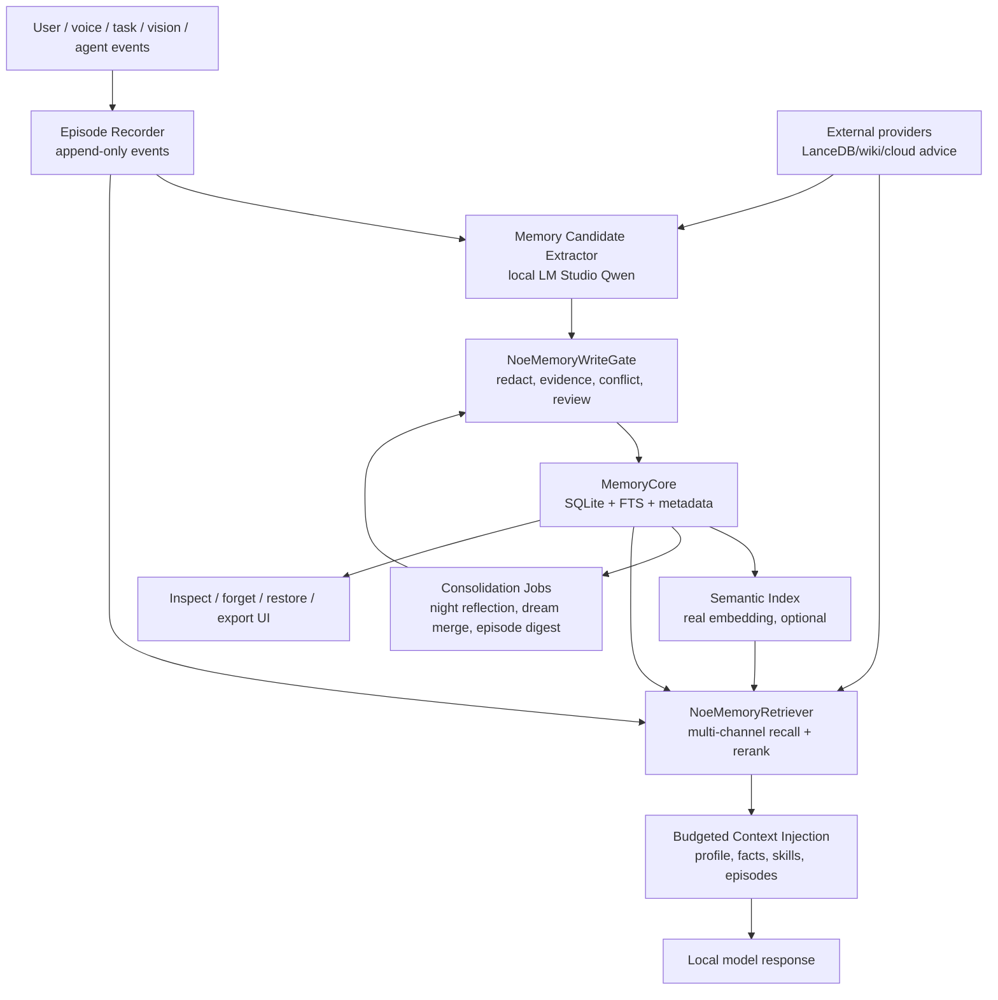

# 设计方案：Noe 本地模型长期记忆 v2

日期：2026-06-13
范围：Neo / Noe Jarvis 在本地模型运行时，如何在上下文窗口耗尽、会话重启、模型切换之后仍保留可验证、可更新、可删除的长期记忆。

## 0. 结论

Noe 现在已经有一套较完整的记忆底座：SQLite `noe_memory`、FTS5、可选向量双路召回、去重/冲突/GC、`events` 自传体时间线、夜间反思、梦境整合、情景升华、SFT/LoRA 数据攒取和只读评测脚本。它不是“没有记忆”。

但它还不是一条强闭环的长期记忆系统。主要问题是：

1. 记忆写入入口分散，缺少统一的 `NoeMemoryWriteGate`。
2. 事实抽取默认仍是 Ollama 风格直连，和当前 LM Studio Qwen 主脑路线不完全一致，失败时容易静默为空。
3. 当前 live DB 中 `source_episode_id` 关联数为 0，74 条 fact 全是 orphan fact，能记但无法稳定追溯“从哪一段经历来”。
4. 召回侧主要用当前 transcript 做 query，结构化目标/人物/任务/时间线没有统一进入多路检索。
5. 真实语义召回需要显式 `NOE_MEMORY_EMBED`，默认不会启用；hash 向量只能做测试兜底。
6. 梦境整合、久远情景升华、夜间反思、SFT 攒取等能力存在，但分散在 env 门控与维护 tick 中，缺少统一健康面板和 retention 验收门。

因此 v2 不应该推翻 `MemoryCore`，而是加一条“本地长期记忆脊椎”：所有记忆候选先进入 gate，有 episode/evidence provenance，再沉淀到 semantic/procedural/profile 层；召回从单 query 升级为多路检索 + 预算化注入；后台整理从可选零件升级成可观测、可回滚、可验收的维护链。

## 0.1 2026-06-13 落地状态

本方案已完成代码落地和自检：

- 新增 schema：`noe_memory_candidate`、`noe_memory_link`、`noe_memory_retrieval_log`，SQLite migration v10；已补 `privacy`、`quote_hash` 兼容列，旧库跑过 v10 后再次启动也会幂等补齐。
- 新增本地写入治理：`NoeMemoryCandidateSchema`、`NoeMemoryAuditLog`、`NoeMemoryWriteGate`。
- 新增结构化抽取器：`NoeMemoryExtractor`，语音事实抽取默认走 LM Studio adapter / Qwen 路线，保留 `FactExtractor` fallback。
- 新增 v2 召回器：`NoeMemoryRetriever` 和 `NoeMemoryContextFormatter`，注入格式为 budgeted `<noe-memory-v2 trust="local">`。
- `VoiceSession` 已改为先记录 episode，再把 `sourceEpisodeId/evidenceRefs` 传给事实抽取和写入门禁；`finish_reason=length` 的半截回复仍不写历史、长期记忆或时间线。
- `NoeMemoryExtractor` 的 `no_write` 输出会带 `noWriteReason` 进入写门；语音 fallback 也不会把 no-write 记录绕过 gate 直写入库。
- `NoeNightlyReflection` 的新 insight 写入已接入 gate，并带最近 episode evidence refs。
- 目标完成后的 `skill_distill` 已从直写 `MemoryCore` 改为先写 milestone episode，再通过 gate 入库。
- `server.js` 组合根已创建共享 `NoeMemoryAuditLog/NoeMemoryWriteGate/NoeMemoryRetriever`，并接入语音、聊天室上下文、夜间反思、技能蒸馏和 `/mind.html`；透视页 owner 编辑也通过 `owner_confirmed` 写门 upsert。
- `/api/noe/mind/memory*` 已提供状态、搜索、导出、隐藏、恢复、编辑、软删除、隔离区、候选回放端点；`mind.html` 已新增长期记忆 v2 卡片，可显示 source/gate/link 并操作搜索/隔离区。
- 新增验证：
  - `npm run verify:noe:memory-retention`
  - `npm run verify:noe:memory-status`
  - `scripts/noe-memory-retention-verify.mjs`
  - `scripts/noe-memory-status.mjs`
  - `tests/unit/noe-memory-write-gate.test.js`
  - `tests/unit/noe-memory-retriever.test.js`
  - `tests/unit/noe-memory-status.test.js`
  - `tests/unit/noe-memory-retention-verify.test.js`
  - `tests/unit/noe-memory-extractor.test.js`
  - `tests/unit/routes/noe-mind-routes.test.js`

已通过：

- `npm run verify:noe:memory-retention`：6 个测试文件、21 条单测通过；临时库 retention 验证 13 项通过；真实库状态报告生成。
  - report：`output/noe-memory-retention/noe-memory-retention-1781317432589.json`
  - status：`output/noe-memory-status/noe-memory-status-1781317432810.json`
- 相关回归：`noe-voice-session`、`noe-turn-context-engine`、`solo-chat-context-engine`、`noe-fact-extractor` 全部通过。
- `npm run verify:noe:self-evolution`：198 passed / 0 failed。
- `npm run verify:handoff`：83 passed / 0 failed。
- `git diff --check -- ':!games/cartoon-apocalypse/**'`：通过。

已知状态：

- 本次没有重启、接管或写入 live 51835；`51735` 未触碰。
- `npm run test:p0:unit` 当前受未跟踪 proposal route/test 漂移阻塞：`tests/unit/routes/noe-proposals-routes.test.js` 对 dry-run 状态期望 `skipped`，实际为 `dry_run_ready`。该文件和 `src/server/routes/noeProposals.js` 在当前 worktree 均为未跟踪文件，不属于本轮长期记忆 v2 改动。
- 真实库状态报告显示当前 live 记忆仍有历史 orphan facts（本次状态脚本输出：visible 519，orphanFacts 74，semanticProvider off，quarantineCount 0）。v2 已保证新自动事实路径带 provenance；历史孤儿事实需要单独 backfill/审查，不应无证自动改写。

## 1. 当前实现现状

### 1.1 存储和召回

核心文件：

- `src/memory/MemoryCore.js`
- `src/storage/SqliteStore.js`
- `src/memory/NoeMemorySemanticIndex.js`
- `src/memory/NoeFusionRanker.js`
- `server.js`

已具备：

- `noe_memory` 表：`project_id`、`scope`、`title`、`body`、`source_type`、`source_id`、`tags`、`confidence`、`ttl_ms`、`expires_at`、`merge_trace`、`salience`、`valid_from`、`valid_to`、`source_episode_id`。
- FTS5 trigram 索引和 trigger，写入/更新/删除同步 FTS。
- `MemoryCore.recall()`：FTS 或 LIKE 召回，默认过滤 hidden/expired，并增加 hit count。
- `MemoryCore.recallFused()`：有 semantic index 时执行 FTS + vector RRF 融合。
- `MemoryCore.hide()/unhide()/merge()/runGc()`：软删、恢复、合并、GC dry/apply。
- `NoeMemoryDedup`：字符近重复去重，保守 update。
- `NoeMemoryConflictPolicy`：偏好/地点/身份等事实槽位的 supersede / merge / ignore / needs_review。

启动接线：

- `server.js` 只有设置 `NOE_MEMORY_EMBED` 时才创建 semantic index。
- 推荐注释是 `NOE_MEMORY_EMBED=ollama NOE_MEMORY_EMBED_MODEL=qwen3-embedding:0.6b`。
- 默认不混入 hash 向量，避免低质量 embedding 稀释 FTS。

### 1.2 情景记忆和连续性

核心文件：

- `src/memory/EpisodicTimeline.js`
- `src/context/NoeSelfKnowledge.js`
- `src/context/NoeNarrativeSelf.js`
- `src/context/NoeSelfModel.js`
- `server.js`

已具备：

- `events` 表里的 `kind='noe_episode'` 作为自传体时间线。
- episode 类型：`interaction`、`observation`、`dream`、`inner_monologue`、`milestone`。
- `EpisodicTimeline.narrative()` 能把最近经历压成 `<noe-recent-timeline>`。
- `server.js` 当前开发者自由档默认把 `NOE_CONTINUITY=1` 打开，连续记忆和 self state 可注入对话。
- 叙事自我 `NoeNarrativeSelf` 独立持久化到 `~/.noe-panel/narrative-self.json`，只读注入，不直接写 identity。

### 1.3 写入入口

当前会写长期记忆的主要路径：

- `VoiceSession`：对话可写 `scope='voice'`，事实抽取可写 `scope='fact'`。
- `FocusStack.pop()`：焦点压缩后写 `scope='focus'`。
- `writeFocusConclusionMemory()`：需 owner ack 或 validated consensus。
- `clusterMemoryTick`：把多模型房间摘要写 `scope='cluster'`。
- `server.js` 的目标完成技能蒸馏：写 `sourceType='skill_distill'`。
- `NoeNightlyReflection`：把夜间洞察写 `scope='insight'`。
- `NoeEpisodeSublimation`：把久远 episode 按周升华成 `scope='episodic_digest'`。
- proactive/vision/brain-ui 等也会写不同 source。

这证明 Noe 已经有多源记忆，但也暴露出 v2 的核心治理问题：写入路径太多，质量、来源、review、source episode 关联不统一。

### 1.4 整理、遗忘和训练

核心文件：

- `src/memory/NoeDreamConsolidation.js`
- `src/memory/NoeMemoryConsolidator.js`
- `src/memory/NoeEpisodeSublimation.js`
- `src/memory/NoeSftHarvester.js`
- `src/server/services/noe-maintenance.js`

已具备：

- 梦境整合：合并重复、降级陈旧、recall heat 晋升，身份级 salience>=5 保护。
- 久远情景升华：90 天前 episode 按周压成长期摘要，赶在 events 默认 180 天保留期之前沉淀。
- SFT 攒取：从 insight、inner monologue、narrative、personality、高显著记忆生成本地 JSONL；敏感内容直接拒收。
- DB backup 默认开启，events retention 默认 180 天，日志 90 天。
- memory GC 支持 `NOE_MEMORY_GC=1|dry`。

但梦境整合、情景升华、夜间反思、SFT 攒取大多是 env 门控，且健康状态没有统一进入“长期记忆可用性”验收。

## 2. 当前实况证据

本次只读检查使用匹配项目 native module 的 Node：

```bash
/Users/hxx/.nvm/versions/node/v22.22.2/bin/node scripts/noe-thought-memory-eval.mjs
/Users/hxx/.nvm/versions/node/v22.22.2/bin/node scripts/noe-personality-dataset-readiness.mjs
```

注意：当前 shell 默认 `/opt/homebrew/bin/node` 是 v26，项目 `better-sqlite3` 是另一个 ABI 编译的，所以直接 `node scripts/...` 会因 native binding ABI 不匹配失败。这里没有 rebuild，也没有改依赖。

只读结果：

- thought-memory eval：`passed=true`，score 100。
- inner monologue grounding：sampleCount 1899，avgScore 0.707，passRate 1，refKeyCount 1899。
- memory count：total 952，visible 520，hidden 432。
- 可见 scope：voice 359、fact 74、project 47、proactive 30、insight 8、user 1、vision 1。
- source type：voice 359、fact_extract 74、skill_distill 42、noe_proactive 30、nightly_reflection 8。
- source-linked memory：0。
- orphan facts：74。
- episode：total 3259，inner_monologue 2469，observation 590，milestone 124，interaction 76，activeDays 4。
- SFT：211 valid pairs，0 invalid，0 sensitive；formal 训练还不够 500，owner training plan 未批准。

解读：

- Noe 已经在产生大量情景和语义材料。
- 当前长期事实记忆能通过基本评测，但 provenance 断层明显：事实和 insight 没有 `source_episode_id`。
- voice 原始对话最多，但 `NoeTurnContextEngine` 会过滤 `scope='voice'`，所以它更多是归档材料，不是可直接注入的长期语义记忆。
- 若上下文满了，只靠当前 transcript 无法保证把旧经历、旧偏好、旧任务经验都召回；必须靠更强的 extractor、gate 和 retriever。

## 3. 设计目标

v2 目标不是“让模型无限上下文”，而是让本地模型在有限上下文内拥有长期连续性：

1. 可追溯：每条长期记忆知道来源 episode、来源事件、证据片段和写入 actor。
2. 可更新：偏好、地点、计划变化时能 supersede，而不是永远并存冲突事实。
3. 可忘记：owner 能查看、隐藏、恢复、删除或降级。
4. 可召回：上下文满时，根据任务/人物/时间/目标/当前对话多路召回相关记忆。
5. 可整理：后台把原始对话和 episode 蒸馏成事实、洞察、技能和叙事。
6. 可验收：有 restart/context-rotation/noise-recall/incomplete-write/secret-rejection 测试。
7. 本地优先：长期记忆的权威写入只发生在本地 gate；云端或外部 provider 只能产候选，不能绕过治理直接写权威记忆。

## 4. v2 架构



### 4.1 五层记忆

1. Hot working context：当前会话、当前任务、当前 UI/vision/action evidence，只保留在上下文和短期状态。
2. Episodic memory：append-only `events/noe_episode`，记录发生过什么，作为长期语义记忆的证据源。
3. Semantic memory：`noe_memory` 里的事实、偏好、决定、洞察、技能、人物关系。
4. Procedural memory：技能卡、任务复盘、行动模板、rollback recipe。
5. External memory mirrors：LanceDB/wiki/其他本地知识库，作为召回加速或参考源，不是权威写库。

### 4.2 统一写入 Gate

新增模块建议：

- `src/memory/NoeMemoryCandidateSchema.js`
- `src/memory/NoeMemoryWriteGate.js`
- `src/memory/NoeMemoryAuditLog.js`

所有长期记忆写入先变成 candidate：

```json
{
  "projectId": "noe",
  "kind": "fact|preference|skill|insight|episode_digest|profile|commitment",
  "scope": "fact",
  "body": "...",
  "title": "...",
  "sourceEpisodeId": "ep:123",
  "sourceEventIds": ["event:123"],
  "evidenceRefs": ["events:123.payload.summary"],
  "actor": "owner|noe|model|tool|consensus|external",
  "confidence": 0.0,
  "salience": 1,
  "validFrom": 1781310000000,
  "validTo": null,
  "privacy": "private|project|exportable",
  "writeMode": "auto|pending|owner_confirmed",
  "risk": "low|medium|high"
}
```

Gate 流程：

1. 拒绝 incomplete / `finish_reason=length` 的模型输出。
2. 先脱敏，再持久化；命中 secret-shaped 内容则 quarantine metadata，不保存正文。
3. 检查 `sourceEpisodeId` 或 `evidenceRefs`。自动事实写入必须有来源；owner 手写可例外，但也记录 actor。
4. 执行 scope lint：代码结构、临时调试步骤、瞬时 UI 状态不进长期事实，除非是 skill/incident 复盘。
5. 执行 dedupe/conflict：近重复 update，偏好/地点等同槽位 supersede，identity/person 高风险进入 review。
6. 对高风险候选调用 Review Brain 或 validated consensus，但最终仍由本地 gate 落地。
7. 写入 `MemoryCore.write()`，同时写 audit event：candidate id、decision、target memory id、reason。

兼容性：保留现有 `memory.write()` API，但逐步把内部调用替换为 `writeGate.commit(candidate)`；外部 provider manager 只能调用 candidate 入口。

## 5. 抽取流程

### 5.1 调整顺序

当前 voice 路径应改成：

1. 本地模型回复完成，且不是 incomplete。
2. 先记录 episode，拿到 `sourceEpisodeId`。
3. 再把 transcript + reply + episode id 交给 extractor。
4. extractor 输出结构化 candidates。
5. candidates 进入 `NoeMemoryWriteGate`。

这能解决当前 live DB `sourceLinked=0` 的断层。

### 5.2 统一本地模型抽取器

新增：

- `src/memory/NoeMemoryExtractor.js`

原则：

- 默认走 `NoeReflectBrain` / LM Studio adapter / Qwen 主脑，不再默认直连 Ollama。
- Ollama 可作为显式 fallback：`NOE_MEMORY_EXTRACTOR=ollama`。
- 输出 JSON candidates，不再只输出 plain lines。
- 每轮最多抽 3-8 条，避免把所有聊天都变长期记忆。
- 对“临时、含糊、玩笑、一次性上下文”输出 `NONE` 或 `writeMode='pending'`。

抽取 prompt 应强制区分：

- owner preference：主人明确表达的偏好。
- stable fact：相对稳定事实。
- commitment：需要未来履行的承诺。
- skill/procedure：完成任务后可复用经验。
- insight：Noe 自己的反思，不等同于 owner 事实。
- no-write：临时对话、闲聊、情绪化推测、敏感内容。

## 6. 召回流程

新增：

- `src/memory/NoeMemoryRetriever.js`
- `src/memory/NoeMemoryContextFormatter.js`

### 6.1 多路检索输入

不要只拿 transcript 做 query。每轮构造 retrieval packet：

- 当前用户问题。
- 当前 active goal / task title。
- 最近 episode summary。
- 已识别人物/owner/person card。
- 当前 UI/vision/action evidence 摘要。
- 当前 route type：chat / task / planning / coding / voice / reflection。

### 6.2 多通道召回

并行召回：

- facts/preferences：稳定事实和 owner 偏好。
- commitments：提醒、承诺、开放循环。
- skills/procedures：任务经验和操作模板。
- episodes：最近或时间窗口匹配的经历。
- insights：最近被验证过的洞察。
- people/person cards：人物关系。
- external：wiki/LanceDB 只读 hits。

每个通道有独立 topK，然后用 RRF + salience + confidence + recency + source quality rerank。

### 6.3 预算化注入

建议默认记忆预算：

- 普通聊天：1200-2000 tokens。
- 任务执行：2000-3500 tokens。
- 长研究/代码：3500-6000 tokens，但不能挤掉 identity/action/evidence guard。

注入格式：

```xml
<noe-memory-v2 trust="local" budget="compact">
  <fact id="mem-..." confidence="0.92" source="ep:123">主人偏好...</fact>
  <skill id="mem-..." confidence="1.0">下次处理类似任务时...</skill>
  <episode id="ep:..." age="2d">最近我们...</episode>
</noe-memory-v2>
```

不要注入原始长对话；voice 原文只用于回放、抽取、争议审计。

## 7. 上下文满了怎么办

本地模型上下文满时不应该继续无限塞历史，而是执行 rolling memory：

1. Hot buffer：保留最近 N 轮完整对话。
2. Turn summary：每 10-20 轮把中间段压成 session summary，作为 episode/detail。
3. Candidate extraction：从压缩段抽 facts/skills/commitments。
4. Memory write gate：只把稳定候选写长期库。
5. Retrieval on demand：下一轮只召回相关记忆，而不是全量历史。
6. Context pressure policy：当 token 压力高，先丢 raw dialogue，再丢低置信 insight，最后才丢 owner preference / active commitment / action guard。

对应到 Noe：

- `MemoryCore` 负责长期语义层。
- `EpisodicTimeline` 负责经历层。
- `NoeMemoryRetriever` 负责从长期库拉回少量相关内容。
- `NoeTurnContextEngine` 只接收 formatter 产出的 compact memory block，不直接拼散乱记忆。

## 8. 外部 provider 策略

当前 `NoeExternalMemoryProviders` 已有 LanceDB/wiki provider PoC，默认 feature flag off，且不替换 `MemoryCore`。v2 保持这个原则：

- LanceDB 可以做大规模向量加速镜像。
- 本地 wiki 可以做只读知识回忆。
- 外部 provider 的结果必须标记 `providerId` 和 `trust=external_untrusted`。
- 外部命中不能直接写 `MemoryCore`；只能变 candidate，由本地 gate 决策。
- 云模型建议不能直接写长期记忆。云可 plan/review，local gate 执行写入和审计。

## 9. 数据模型增量

不需要推翻现有表。建议增加：

### 9.1 `noe_memory_candidate`

保存候选和 gate 决策，便于回放：

- `id`
- `project_id`
- `candidate_json`
- `decision`: `accepted|rejected|quarantined|needs_review|merged|superseded`
- `reason`
- `target_memory_id`
- `created_at`
- `decided_at`

### 9.2 `noe_memory_link`

显式链接 memory、episode、event、file、tool evidence：

- `id`
- `memory_id`
- `link_type`: `source_episode|source_event|evidence_file|tool_run|external_hit`
- `ref`
- `quote_hash`
- `created_at`

### 9.3 `noe_memory_retrieval_log`

只存 metadata，不存敏感正文：

- `id`
- `turn_id`
- `query_hash`
- `channels_json`
- `hit_ids_json`
- `selected_ids_json`
- `dropped_reason_json`
- `created_at`

这能回答：“为什么这轮想起了 A，没想起 B？”

## 10. 安全和治理

必须保持：

- `.env`、API keys、tokens、cookies、owner tokens、OAuth 文件不读、不入库、不注入。
- `MemoryCore.write()` 前和 context injection 前都脱敏。
- SFT/LoRA 数据比普通记忆更危险，因为进权重后不好删除；继续执行敏感 regex hard reject。
- identity/person/salience>=5 只能 owner confirmed 或 validated consensus 后更新。
- 所有自动写入可 soft-hide 和 rollback。
- 外部 provider 默认 off，单 provider 限制继续保留，工具名不得 shadow `memory.write/recall`。

## 11. 验收门

新增脚本：

```bash
npm run verify:noe:memory-retention
```

建议覆盖：

1. restart retention：写入 owner preference，重启/重建对象后仍能召回。
2. context rotation：注入 200k token 噪声后，仍能召回目标事实。
3. source linkage：fact/skill/insight 必须有 `sourceEpisodeId` 或 `evidenceRefs`。
4. update preference：`喜欢美式` -> `现在改喝拿铁` 后，旧事实 valid_to，新事实 valid_from。
5. no secret memory：secret-shaped 文本被拒绝或 quarantine，不入正文库、不进 SFT。
6. incomplete output：`finish_reason=length` 不写 dialogue/fact/episode/insight。
7. assistant mode：明确验证 assistant/companion/private/temporary memory policy 差异。
8. real semantic provider：若 `NOE_MEMORY_EMBED=ollama`，报告 provider/model 和向量召回命中；若未启用，诚实标 `semantic_recall_disabled`。
9. orphan budget：`source_episode_id` 缺失率必须下降；新写 fact orphan rate 为 0。
10. UI forget：hide/unhide/delete/export 走审计，能被 report 看到。

健康报告新增字段：

- `memory.visible`
- `memory.byScope`
- `memory.bySourceType`
- `memory.sourceLinked`
- `memory.orphanFacts`
- `memory.semanticProvider`
- `memory.lastConsolidation`
- `memory.lastEpisodeSublimation`
- `memory.retrievalHitRate`
- `memory.quarantineCount`

## 12. 分阶段落地

### P0：只读审计与状态面板

- 新增 `scripts/noe-memory-status.mjs`。
- 读取 DB 计数、orphan facts、semantic provider、dream/reflection/env 状态。
- 不改变行为。

验收：能输出当前这类数据，且不输出正文和敏感值。

### P1：source episode linkage

- 调整 `VoiceSession`：先 `episodicTimeline.record()`，再 fact extraction。
- `FactExtractor.extractRecords()` 必须接收 `sourceEpisodeId`。
- `NoeNightlyReflection` 和 skill distill 写入 `evidenceRefs` 或 `sourceEpisodeId`。

验收：新写 fact orphan rate 为 0。

### P2：MemoryWriteGate

- 实现 candidate schema 和 gate。
- 先把 voice fact、skill_distill、nightly_reflection 三条高价值路径接入。
- 保持旧 `MemoryCore.write()` 不破坏。

验收：候选 audit 可回放；incomplete/secret/low confidence 能被拒绝。

### P3：本地结构化 extractor

- `NoeMemoryExtractor` 走 LM Studio / NoeReflectBrain。
- 输出 JSON candidates。
- Ollama 变显式 fallback。

验收：对同一对话能抽出稳定 fact，并保留 no-write 理由。

### P4：Retriever v2

- 实现多通道召回和 formatter。
- `NoeTurnContextEngine` 改为消费 compact memory block。
- 任务执行和普通聊天采用不同预算。

验收：context rotation 测试通过。

### P5：维护闭环

- 把 dream/reflection/episode sublimation/GC/SFT 的状态统一到 memory status。
- 默认仍可保守，但 readiness 必须诚实显示“哪些没通电”。

验收：长期记忆状态能解释“为什么没有生成 insight/episodic_digest/SFT”。

### P6：UI 控制

- mind panel 增加 Memory tab：查看、搜索、隐藏、恢复、编辑、导出、quarantine。
- 显示来源 episode 和 gate reason。

验收：owner 能纠错，系统下次召回遵守纠错。

## 13. 与现有文件的改造点

优先级最高：

- `src/voice/VoiceSession.js`：调整 episode/fact 写入顺序，传 `sourceEpisodeId`。
- `src/memory/FactExtractor.js`：改成结构化 extractor 或作为 fallback。
- `src/memory/MemoryCore.js`：保持底层 API，补 candidate/audit/link 辅助。
- `src/context/NoeTurnContextEngine.js`：由散装 recall 改成 `NoeMemoryRetriever` 的 compact block。
- `src/memory/NoeNightlyReflection.js`：洞察写入补 evidence refs。
- `server.js`：memory status 接线，暴露 provider/env 状态但不暴露 secret。
- `scripts/noe-thought-memory-eval.mjs`：加入 source linkage / orphan fact blocker。
- `scripts/noe-personality-dataset-readiness.mjs`：继续只读，不输出正文。

后续：

- `src/memory/NoeExternalMemoryProviders.js`：保持 mirror/read-through，不成为权威。
- `src/memory/NoeDreamConsolidation.js`：产出的 merge/downgrade/promote 也进入 audit。
- `src/memory/NoeEpisodeSublimation.js`：digest 写入补 episode range link。

## 14. 外部参考

- MemGPT / Letta 的核心启发是“虚拟上下文管理”：模型上下文有限，但系统可以通过层级记忆和显式换页/检索维持长期状态。参考：https://arxiv.org/abs/2310.08560
- LangChain long-term memory 的工程要点是跨 session 的 namespace/key-value store，没有一种通用记忆形态适合所有任务；Noe 应分 facts / skills / episodes / commitments。参考：https://docs.langchain.com/oss/python/langchain/long-term-memory
- OpenAI cookbook 的 context personalization 示例强调 local-first state、session notes distill、global notes consolidate，再按 precedence 注入上下文；Noe 可用同样原则，但权威存储保持本地。参考：https://developers.openai.com/cookbook/examples/agents_sdk/context_personalization

## 15. 最小可执行方案

如果只做一轮最小改造，建议顺序是：

1. 增加 `scripts/noe-memory-status.mjs`，把当前 live DB 状态固定成可复查报告。
2. 修 `VoiceSession` 写入顺序，让新 fact 必带 `sourceEpisodeId`。
3. 增加 `NoeMemoryWriteGate`，先保护 voice fact / skill_distill / nightly insight 三条路径。
4. 用 LM Studio Qwen 改造 extractor，输出 JSON candidates。
5. 加 `verify:noe:memory-retention`，把“上下文满后仍能记住”变成可跑的验收，而不是主观感觉。

这条路径风险最低：不替换 `MemoryCore`，不重做 DB，不改变 51835 运行方式，先把长期记忆从“有材料”升级为“可证明、可追责、可更新”。

## 16. 2026-06-13 后期路线图推进状态

本轮补齐了“后期路线图是否达标”的可运行验收层，不把主观判断当完成证据：

- 新增 `NoeMemoryRecallBenchmark`：用 labeled query -> expected memory id 计算 recall/precision，默认隔离库，不输出记忆正文。
- 新增 `NoeMemoryMaintenanceDryRun`：统一 dream consolidation 与 `MemoryCore.runGc()` 的 dry-run 报告，默认不改库。
- 新增 `NoeMemoryProvenanceBackfill`：只从真实 `noe_episode` 做历史 weak fact 来源匹配，默认 dry-run；阈值默认 `0.78`，低分不自动写强来源；真实写入必须同时传 `--apply --ack-provenance-apply`。
- 新增 `NoeMemoryRoadmapVerifier`：把 isolated lifecycle canary、recall benchmark、真实库 source/quarantine 状态、maintenance dry-run、provenance backfill 计划汇总成一份路线图报告。
- 新增 npm 入口：
  - `npm run verify:noe:memory-recall-benchmark`
  - `npm run verify:noe:memory-maintenance-dry-run`
  - `npm run verify:noe:memory-provenance-backfill`
  - `npm run verify:noe:memory-roadmap`

最新验证：

- `npm run verify:noe:memory-roadmap` 通过，报告：`output/noe-memory-roadmap/noe-memory-roadmap-1781342789999.json`。
- `npm run verify:noe:memory-retention` 通过，报告：`output/noe-memory-retention/noe-memory-retention-1781342273256.json`。
- 单项报告：
  - recall benchmark：`output/noe-memory-recall-benchmark/noe-memory-recall-benchmark-1781342293478.json`，后续已升级为 4 cases（含干扰项和负样本），路线图报告内 4/4 passed。
  - maintenance dry-run：`output/noe-memory-maintenance-dry-run/noe-memory-maintenance-dry-run-1781342293479.json`，当前 plan 无 merge/downgrade/promotion/GC candidate。
  - provenance backfill：`output/noe-memory-provenance-backfill/noe-memory-provenance-backfill-1781342789694.json`，保守阈值下 `matchCount=1`，未写库；写入前必须人工复核并显式 ack。

当前真实库 required gates：

- `isolated_lifecycle_canary` passed。
- `recall_benchmark` passed。
- `real_db_status_readable` passed。
- `real_db_no_unreviewed_orphans` passed：当前 `factTotal=65`、`unreviewedOrphanFacts=0`，但 `linkedFacts=0` / `orphanFacts=65` 仍是历史 weak-source 债。
- `real_db_quarantine_clear` passed：`quarantineCount=0`。

当前不能宣称“完美生产闭环”的 advisory blockers：

- `semantic_runtime_enabled=false`：真实库已有 stored embeddings，但运行时仍是 `stored_index_unconfigured`。
- `retrieval_evidence_sample_sufficient=false`：真实 retrieval log 仍只有 3 条，样本不足。
- `maintenance_loop_active=false`：dream / episodeSublimation / memoryGc 当前仍未启用；已具备 dry-run，但未进入后台闭环。

因此本轮完成的是路线图验收与安全执行工具链；真正的生产闭环完成还需要 owner 明确选择是否启用语义 provider、是否把维护 loop 从 dry-run 推到受控 apply，以及是否允许对真实库低风险 canary/来源回填做写入验证。
